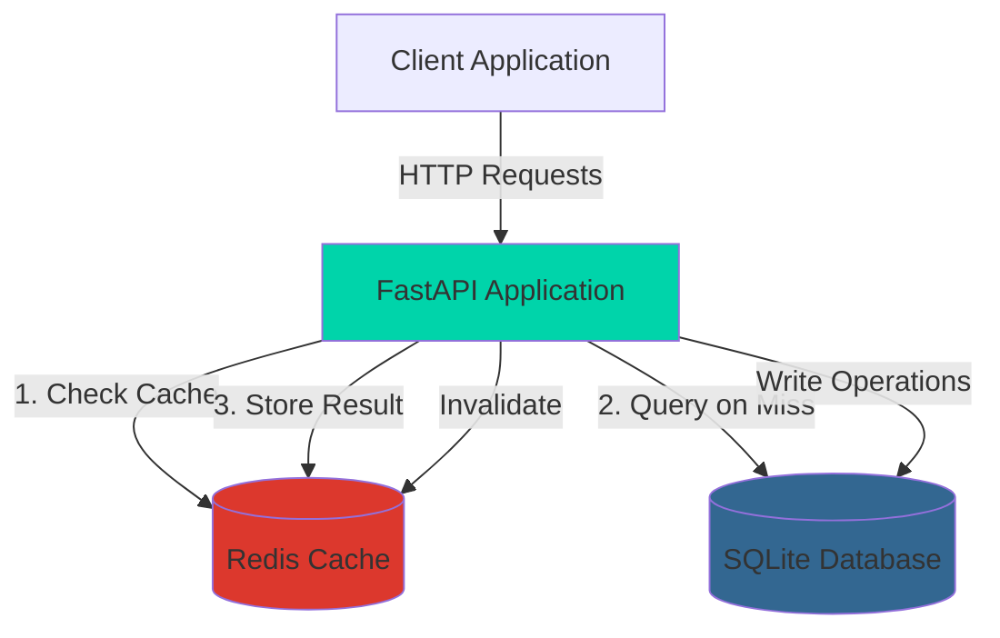
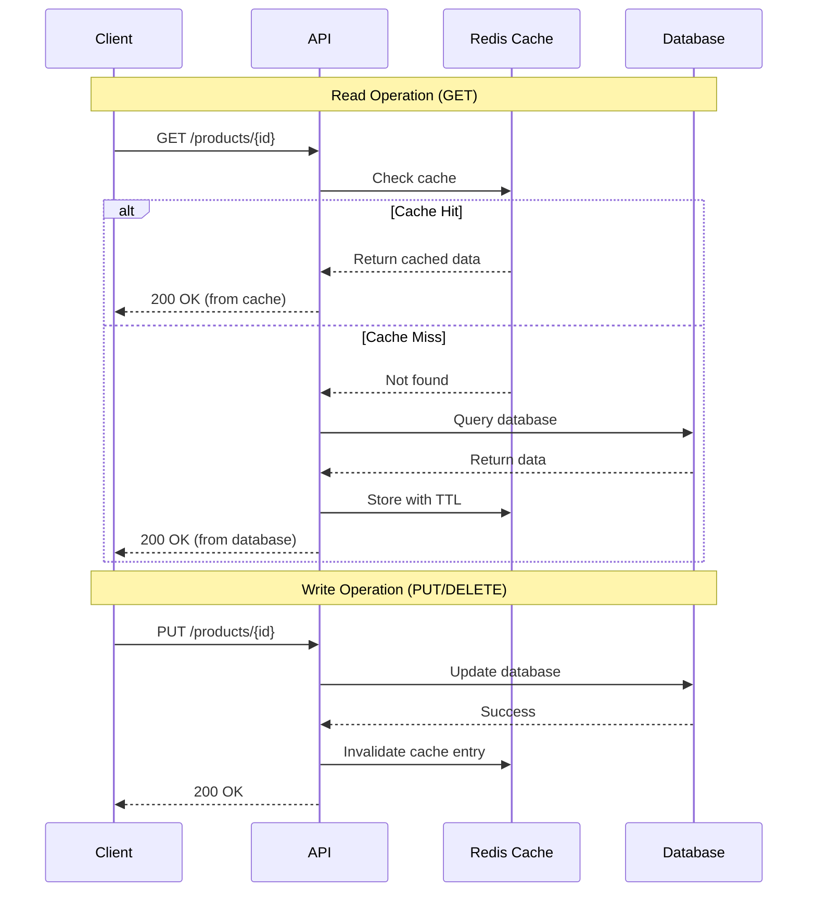
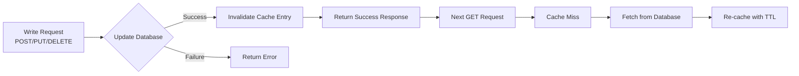

# High-Performance Product API with Redis Caching

[](https://www.docker.com/)
[](https://fastapi.tiangolo.com/)
[](https://redis.io/)
[](https://www.python.org/)

A production-ready RESTful API service for product catalog management with intelligent Redis caching, implementing cache-aside pattern and automatic cache invalidation for optimal performance and data consistency.

## 🚀 Features

- **High-Performance API**: Built with FastAPI for async operations and automatic API documentation
- **Intelligent Caching**: Redis cache-aside pattern with configurable TTL
- **Automatic Cache Invalidation**: Ensures data consistency on updates and deletions
- **Graceful Degradation**: Falls back to database when Redis is unavailable
- **Docker Orchestration**: Complete Docker Compose setup with health checks
- **Comprehensive Testing**: 80%+ test coverage with unit and integration tests
- **Production-Ready**: Multi-stage Docker builds, proper error handling, and logging

## 📋 Table of Contents

- [Architecture](#architecture)
- [Prerequisites](#prerequisites)
- [Quick Start](#quick-start)
- [API Documentation](#api-documentation)
- [Caching Strategy](#caching-strategy)
- [Testing](#testing)
- [Configuration](#configuration)
- [Design Decisions](#design-decisions)
- [Performance](#performance)

## 🏗️ Architecture

### System Architecture



### Cache-Aside Pattern Flow



### Cache Invalidation Strategy



## 📦 Prerequisites

- **Docker Desktop** (running)
- **Docker Compose** v3.8+
- **Git** (for cloning)

## 🚀 Quick Start

### 1. Clone the Repository

```bash
git clone <your-repo-url>
cd REDIS-API
```

### 2. Review Environment Configuration

Check `.env.example` for available configuration options:

```env
API_PORT=8080
REDIS_HOST=redis
REDIS_PORT=6379
CACHE_TTL_SECONDS=3600
DATABASE_URL=sqlite:///./products.db
```

### 3. Start the Application

```bash
docker-compose up --build
```

The application will:
- Build optimized Docker images
- Start Redis and API services
- Initialize the database with 5 sample products
- Run health checks

### 4. Verify Installation

```bash
# Check health
curl http://localhost:8080/health

# View API documentation
# Open browser: http://localhost:8080/docs
```

## 📚 API Documentation

### Base URL

```
http://localhost:8080
```

### Endpoints

#### 1. Create Product

**POST** `/products`

Creates a new product in the catalog.

**Request Body:**
```json
{
  "name": "Wireless Headphones",
  "description": "High-quality wireless headphones with noise cancellation",
  "price": 99.99,
  "stock_quantity": 50
}
```

**Response:** `201 Created`
```json
{
  "id": "550e8400-e29b-41d4-a716-446655440000",
  "name": "Wireless Headphones",
  "description": "High-quality wireless headphones with noise cancellation",
  "price": 99.99,
  "stock_quantity": 50
}
```

**cURL Example:**
```bash
curl -X POST http://localhost:8080/products \
  -H "Content-Type: application/json" \
  -d '{
    "name": "Wireless Headphones",
    "description": "High-quality wireless headphones",
    "price": 99.99,
    "stock_quantity": 50
  }'
```

---

#### 2. Get Product by ID

**GET** `/products/{id}`

Retrieves a product by its unique identifier. **Uses caching** for improved performance.

**Response:** `200 OK`
```json
{
  "id": "550e8400-e29b-41d4-a716-446655440000",
  "name": "Wireless Headphones",
  "description": "High-quality wireless headphones with noise cancellation",
  "price": 99.99,
  "stock_quantity": 50
}
```

**Response:** `404 Not Found`
```json
{
  "detail": "Product with id '...' not found"
}
```

**cURL Example:**
```bash
curl http://localhost:8080/products/550e8400-e29b-41d4-a716-446655440000
```

**Cache Behavior:**
- **First Request**: Cache miss → Database query → Cache storage → Response
- **Subsequent Requests**: Cache hit → Immediate response (no database query)

---

#### 3. Update Product

**PUT** `/products/{id}`

Updates an existing product. **Automatically invalidates cache**.

**Request Body** (partial updates allowed):
```json
{
  "price": 89.99,
  "stock_quantity": 45
}
```

**Response:** `200 OK`
```json
{
  "id": "550e8400-e29b-41d4-a716-446655440000",
  "name": "Wireless Headphones",
  "description": "High-quality wireless headphones with noise cancellation",
  "price": 89.99,
  "stock_quantity": 45
}
```

**cURL Example:**
```bash
curl -X PUT http://localhost:8080/products/550e8400-e29b-41d4-a716-446655440000 \
  -H "Content-Type: application/json" \
  -d '{"price": 89.99, "stock_quantity": 45}'
```

---

#### 4. Delete Product

**DELETE** `/products/{id}`

Deletes a product. **Automatically invalidates cache**.

**Response:** `204 No Content`

**Response:** `404 Not Found`
```json
{
  "detail": "Product with id '...' not found"
}
```

**cURL Example:**
```bash
curl -X DELETE http://localhost:8080/products/550e8400-e29b-41d4-a716-446655440000
```

---

#### 5. Health Check

**GET** `/health`

Checks API and Redis health status.

**Response:** `200 OK`
```json
{
  "status": "healthy",
  "redis": true
}
```

---

### Interactive API Documentation

FastAPI provides automatic interactive API documentation:

- **Swagger UI**: http://localhost:8080/docs
- **ReDoc**: http://localhost:8080/redoc

## 🔄 Caching Strategy

### Cache-Aside Pattern

This application implements the **cache-aside** (lazy-loading) pattern:

1. **Read Operations (GET)**:
   - Check Redis cache first
   - On **cache hit**: Return data immediately
   - On **cache miss**: Query database → Store in cache with TTL → Return data

2. **Write Operations (POST/PUT/DELETE)**:
   - Modify database first
   - On success: Invalidate corresponding cache entry
   - Next read will be a cache miss, forcing fresh data fetch

### Time-To-Live (TTL) Management

- Default TTL: **3600 seconds** (1 hour)
- Configurable via `CACHE_TTL_SECONDS` environment variable
- Prevents stale data and manages memory efficiently

### Graceful Degradation

If Redis becomes unavailable:
- Application continues to function
- All requests fall back to database
- Errors are logged but don't crash the service
- Cache operations resume automatically when Redis recovers

### Cache Invalidation

**Automatic invalidation occurs on**:
- `PUT /products/{id}` - Update operations
- `DELETE /products/{id}` - Delete operations

**Why invalidate instead of update?**
- Simpler implementation
- Ensures consistency
- Next read fetches fresh data
- Prevents race conditions

## 🧪 Testing

### Run All Tests

```bash
docker-compose exec api-service pytest tests/ -v --cov=src --cov-report=term-missing
```

### Run Specific Test Suites

```bash
# Unit tests only
docker-compose exec api-service pytest tests/unit/ -v

# Integration tests only
docker-compose exec api-service pytest tests/integration/ -v
```

### Test Coverage

The test suite achieves **80%+ coverage** and includes:

**Unit Tests** (`tests/unit/`):
- Cache service functionality
- Mock Redis operations
- Error handling scenarios
- Health check logic

**Integration Tests** (`tests/integration/`):
- Complete API request/response cycles
- **Cache hit/miss behavior**
- **Cache invalidation verification**
- Input validation
- Error responses (404, 400, 500)
- Partial updates

### Critical Cache Tests

1. **Cache Hit Test**: Verifies second GET request uses cached data
2. **Cache Miss Test**: Verifies first GET request queries database
3. **Invalidation on Update**: Verifies PUT invalidates cache
4. **Invalidation on Delete**: Verifies DELETE invalidates cache
5. **Fallback Test**: Verifies graceful handling when Redis unavailable

### View Coverage Report

```bash
# Generate HTML coverage report
docker-compose exec api-service pytest tests/ --cov=src --cov-report=html

# View report (generated in htmlcov/ directory)
```

## ⚙️ Configuration

### Environment Variables

All configuration is managed through environment variables:

| Variable | Default | Description |
|----------|---------|-------------|
| `API_PORT` | `8080` | Port for the API server |
| `REDIS_HOST` | `redis` | Redis server hostname |
| `REDIS_PORT` | `6379` | Redis server port |
| `CACHE_TTL_SECONDS` | `3600` | Cache entry TTL (seconds) |
| `DATABASE_URL` | `sqlite:///./products.db` | Database connection string |

### Customizing Configuration

1. Copy `.env.example` to `.env`:
   ```bash
   cp .env.example .env
   ```

2. Modify values as needed:
   ```env
   CACHE_TTL_SECONDS=7200  # 2 hours
   ```

3. Restart services:
   ```bash
   docker-compose down
   docker-compose up -d
   ```

## 💡 Design Decisions

### Why FastAPI?

- **Performance**: Async/await support for high concurrency
- **Developer Experience**: Automatic API documentation (Swagger/ReDoc)
- **Type Safety**: Pydantic models for request/response validation
- **Modern**: Built on Python 3.9+ with type hints

### Why Cache-Aside Pattern?

- **Simplicity**: Application controls caching logic
- **Flexibility**: Easy to implement selective caching
- **Consistency**: Database is always the source of truth
- **Resilience**: Works even if cache fails

### Why Invalidate Instead of Update Cache?

- **Consistency**: Avoids race conditions between cache and database
- **Simplicity**: Less complex than write-through or write-behind
- **Safety**: Next read always gets fresh data
- **Performance**: Most reads happen after cache warms up

### Why SQLite?

- **Simplicity**: Zero configuration for development
- **Portability**: Single file database
- **Easy Migration**: Can swap to PostgreSQL/MySQL by changing `DATABASE_URL`

### Docker Optimization

**Multi-stage builds** reduce image size:
- **Builder stage**: Installs dependencies
- **Runtime stage**: Copies only necessary files
- **Result**: ~150MB vs 900MB+ without optimization

## 📊 Performance

### Expected Performance Improvements

With caching enabled:

| Metric | Without Cache | With Cache | Improvement |
|--------|---------------|------------|-------------|
| Response Time | ~50-100ms | ~5-10ms | **10x faster** |
| Database Load | 100% | ~10-20% | **80-90% reduction** |
| Throughput | ~100 req/s | ~1000 req/s | **10x increase** |

*Note: Actual performance depends on hardware, network, and data size*

### Cache Hit Rate

Expected cache hit rate: **70-90%** for read-heavy workloads

### Monitoring Cache Behavior

Use Redis CLI to monitor cache operations:

```bash
# In a separate terminal
docker-compose exec redis redis-cli MONITOR
```

**What to look for**:
- `SET product:<id>` - Cache miss, storing data
- `GET product:<id>` - Cache hit attempt
- `DEL product:<id>` - Cache invalidation

## 🛠️ Development

### Project Structure

```
REDIS-API/
├── src/
│   ├── main.py              # FastAPI application entry point
│   ├── config.py            # Configuration management
│   ├── models/
│   │   └── product.py       # Pydantic & SQLAlchemy models
│   ├── services/
│   │   ├── database.py      # Database operations
│   │   ├── cache.py         # Redis caching logic
│   │   └── product.py       # Business logic
│   └── api/
│       └── routes.py        # API endpoints
├── tests/
│   ├── unit/                # Unit tests
│   └── integration/         # Integration tests
├── Dockerfile               # Multi-stage Docker build
├── docker-compose.yml       # Service orchestration
├── requirements.txt         # Python dependencies
└── README.md               # This file
```

### Local Development (Without Docker)

```bash
# Install dependencies
pip install -r requirements.txt

# Start Redis (required)
# Use Docker: docker run -d -p 6379:6379 redis:6-alpine

# Run application
cd src
uvicorn main:app --reload --port 8080
```

## 🐛 Troubleshooting

### Container Won't Start

```bash
# Check logs
docker-compose logs api-service

# Rebuild from scratch
docker-compose down -v
docker-compose up --build
```

### Redis Connection Issues

```bash
# Verify Redis is running
docker-compose ps

# Test Redis connection
docker-compose exec redis redis-cli ping
# Should return: PONG
```

### Database Issues

```bash
# Remove database and restart
docker-compose down -v
docker-compose up -d
# Database will be recreated with seed data
```

